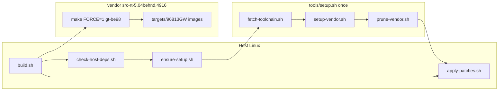

# 01 — Host OS and build flow

How **gt-be98-firmware** bootstraps vendor + toolchain, applies patches, and invokes the Merlin/Broadcom SDK build on a native Linux host.

## End-to-end flow



## Entry points

| Script | When | What it does |
|--------|------|----------------|
| `./build.sh` | Normal build | Deps → setup if needed → patches → `make FORCE=1 gt-be98` → `verify-artifact.sh` |
| `./tools/setup.sh` | Manual bootstrap | Toolchain + vendor clone + prune + patches |
| `./tools/apply-patches.sh` | After vendor reset | Idempotent `patch -p1` from `patches/` |

`build.sh` always re-runs `apply-patches.sh` so vendor tree resets do not leave stale sources.

## Bootstrap (`tools/setup.sh`)

Four phases (see [../scripts.md](../scripts.md)):

1. **`fetch-toolchain.sh`** — clones [RMerl/am-toolchains](https://github.com/RMerl/am-toolchains) into `toolchain/am-toolchains/`; commit recorded in `toolchain/TOOLCHAIN_PIN`.
2. **`setup-vendor.sh`** — clones [gnuton/asuswrt-merlin.ng](https://github.com/gnuton/asuswrt-merlin.ng) into `vendor/asuswrt-merlin.ng/`; ref in `UPSTREAM`.
3. **`prune-vendor.sh`** — drops unused Merlin SDK trees; keeps **`src-rt-5.04behnd.4916`** for GT-BE98.
4. **`apply-patches.sh`** — applies **23** patches (`0001`–`0023`, plus `0013b` for alternate lldpd).

## Patch layer vs build stage

Patches target the **Merlin router userspace** and **host tools** used during that build—not the Linux kernel tree directly.

| Stage | Typical paths touched by patches |
|-------|----------------------------------|
| Router Makefile / config | `release/src/router/Makefile`, `release/src/router/config/Makefile` |
| Router packages | `release/src/router/{nfs-utils,portmap,lighttpd,ipset,lldpd,strongswan,...}/` |
| SDK / U-Boot config | `release/src-rt-5.04behnd.4916/release/src-rt/platform.mak`, `bootloaders/build/configs/options_6813_nand.conf.GT-BE98` |
| Board sysdep | `release/src-rt-5.04behnd.4916/router-sysdep.gt-be98/cjson/` (0022 + `tools/ensure-cjson-makefile.sh`) |

Full table: [../../patches/README.md](../../patches/README.md).

Semantic skip logic in `apply-patches.sh` avoids false “already applied” when `patch -R` would lie; required patches **0006**, **0021**, **0022** are verified before build proceeds.

## Environment variables

| Variable | Set by | Purpose |
|----------|--------|---------|
| `GTBE98_ROOT` | `build.sh` | Repo root; patches and helpers resolve paths |
| `GTBE98_TC_ROOT` | `build.sh` | `toolchain/am-toolchains/brcm-arm-hnd` — replaces `/opt/toolchains` (patch 0007–0009) |
| `LD_LIBRARY_PATH` | Cleared / sanitized | Prevents host `cc1` from loading cross `lib/` (patch 0009) |
| `TMPDIR` | `build.sh` | `logs/build-tmp` — large link steps avoid `/tmp` quota |
| `FORCE=1` | `build.sh` | Merlin/SDK rebuild even if profile timestamp unchanged |
| `UPSTREAM_REF` / `TC_REF` | Optional at setup | Override Merlin branch or toolchain commit |

Host env sanitization: `tools/sanitize-host-env.sh`, sourced from `build.sh` and `tools/env.sh`.

## Pins and provenance

| File | Records |
|------|---------|
| `UPSTREAM` | Merlin URL, ref, commit after `setup.sh` |
| `toolchain/TOOLCHAIN_PIN` | am-toolchains commit |

## Logs and artifacts

| Path | Content |
|------|---------|
| `logs/build_YYYYMMDD_HHMMSS.log` | Full `make` transcript |
| `logs/patch-apply/` | Per-patch apply log from `apply-patches.sh` |
| `logs/build-tmp/` | `TMPDIR` for compiler temporaries |
| `logs/patch-tmp/` | Patch dry-run temporaries |

## Host dependencies

Quick check: `./tools/check-host-deps.sh` (full) or `--quick` at start of `build.sh`.

Arch package list: [../host-deps-arch.md](../host-deps-arch.md). Notable additions for this tree: **`gengetopt`** (coovachilli, optional regen), build essentials, `dtc`, `uboot-tools` (`mkimage` for verify).

## `build.sh` extras (GT-BE98 specific)

Before `make`:

- **cjson guard** — confirms CMake policy line in `router-sysdep.gt-be98/cjson/Makefile`.
- **bwdpi headers** — copies `bcm4916-tmcfg*.h` shims when `bwdpi_source` is present.
- **`build.sh clean`** — removes stale busybox autoconf, curl/lighttpd/nfs objects, cjson build dir.

After successful `make`:

- Lists `targets/96813GW/GT-BE98_*.pkgtb`
- Runs **`tools/verify-artifact.sh`** (FIT, embedded squashfs, critical binaries under `fs.install`).

## SDK model target

Inside `vendor/.../src-rt-5.04behnd.4916/`:

```text
make FORCE=1 gt-be98
```

From `chip_profile.mak`: `GT-BE98_CHIP_PROFILE=6813` → profile **`96813GW`**, board **`GT-BE98`**.

Merlin copies `router-sysdep.gt-be98/` → `router-sysdep/` before building router userspace. See [02-build-graph.md](02-build-graph.md).
