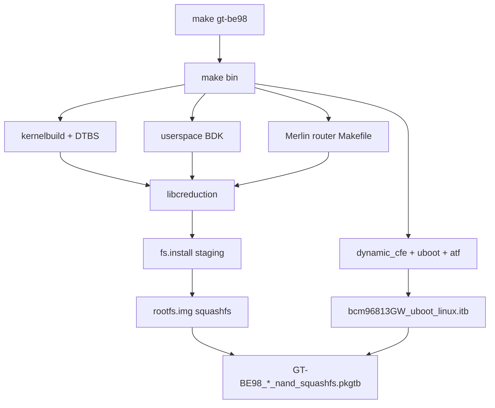

# 02 — Build dependency graph

How **`make gt-be98`** in the Merlin top Makefile drives the Broadcom SDK **`build/Makefile`** and produces flashable artifacts under **`targets/96813GW/`**.

## Top-level Merlin targets

`release/src-rt-5.04behnd.4916/Makefile` defines pattern rules such as `gt-%`:

1. **`save_src_config`** — saves router Kconfig for the model (`gt-be98`).
2. Copies **`router-sysdep.gt-be98/`** → **`router-sysdep/`** (board overlay).
3. **`bin`** — main firmware build (delegates into SDK `build/`).
4. **`setprofile`** / image packaging — profile **`96813GW`**.

Chip mapping (`chip_profile.mak`):

```text
GT-BE98_CHIP_PROFILE=6813  →  targets/96813GW/
```

Router sources for HND builds live under:

```text
bcmdrivers/broadcom/net/wl/bcm96813/main/src/router/
```

(shared Merlin tree: `release/src/router/`).

## SDK `build/Makefile` overview

Default goal chain (`all_postcheck1`):

```text
profile_saved_check → rdp_link → parallel_targets → gdbserver → full_buildimage
```

**`parallel_targets`** (single parallel wave):

```text
dynamic_cfe | uboot | hnd_dongle | kernelbuild | prepare_linux_image |
modbuild | userspace | optee | atf | rtpolicy_gen_metadata | hosttools_image
```

**`full_buildimage`** depends on `kernelbuild`, device trees (`$(DTBS)`), **`libcreduction`**, credits, linux tools, then falls through to **`buildimage`**.

## Build graph (logical)



## Parallel legs (what each target owns)

| Target | Output / role |
|--------|----------------|
| `kernelbuild` + `$(DTBS)` | Linux **4.19**, **`GT-BE98.dtb`** from `kernel/dts/6813/GT-BE98.dts` |
| `userspace` | Broadcom BDK userspace (platform daemons, libs; wired via Bcmbuild) |
| `uboot` / `atf` / `dynamic_cfe` | Boot chain, CFE, FIT inputs |
| `router` (under bcm96813 `src/router`) | Asus Merlin userspace → installed into staged rootfs |
| `libcreduction` | Final rootfs assembly, strip/shrink, pre-squashfs install |
| `buildimage` / `full_buildimage` | `fs.install` → **`rootfs.img`** → **`.pkgtb`** bundle |

Despite the name, **`libcreduction`** is the stage that consolidates router + BDK content into the install tree before imaging (see comments in `hostTools/libcreduction/Makefile`).

## Router Makefile (Merlin)

`release/src/router/Makefile`:

- **`obj-y`** — always built for this profile (e.g. `busybox`, `shared`, `nvram`, `httpd`, `dnsmasq`, `ipset-7.6`, `iptables`, `rc`, `ctf`, `dhd_monitor`).
- **`obj-$(RTCONFIG_*)`** — **344** conditional lines (of **438** total `obj-$(...)` lines); **226** `RTCONFIG_*=y` in the GT-BE98 `.config` used for this tree (see [04-packages.md](04-packages.md)).
- **`obj-$(HND_ROUTER)`** — HND-specific pieces including **`bcm_boot_launcher`**, **`httpdshared`**.

Install staging ends under:

```text
targets/96813GW/fs.install/
```

## Board overlay (`router-sysdep.gt-be98`)

Copied to `router-sysdep/` during `gt-be98` target. Adds:

- **`scripts/`** — `mount-fs.sh`, power/LED helpers, rc3 symlinks
- **`wlan/scripts/`** — `hndnvram.sh`, `wifi.sh`, `S45bcm-wlan-drivers`
- **`mcpd/`**, **`bdmf_shell/`** (RDPA init), **`cjson/`**, **`wdtctl/`**, etc.

Built via Broadcom **`Bcmbuild.mk`** / router-sysdep Makefiles, not only `obj-$(RTCONFIG_*)`.

## Image directory

All profile outputs:

```text
vendor/asuswrt-merlin.ng/release/src-rt-5.04behnd.4916/targets/96813GW/
```

Typical files after success:

| Artifact | Role |
|----------|------|
| `GT-BE98_<ver>_nand_squashfs.pkgtb` | OTA/update bundle |
| `GT-BE98_<ver>_nand_squashfs_loader.pkgtb` | Larger bundle (includes loader) |
| `rootfs.img` | Squashfs root filesystem |
| `bcm96813GW_uboot_linux.itb` | FIT: ATF + U-Boot + kernel + DTB |
| `fs.install/` | Unsquashed staging tree |

## What this repo does not build separately

- No Docker wrapper; native host only.
- No alternate OpenWrt feed — everything flows through the single SDK graph above.

For host-side wrapper details see [01-host-and-build.md](01-host-and-build.md). For artifact layout see [03-firmware-formats.md](03-firmware-formats.md).
