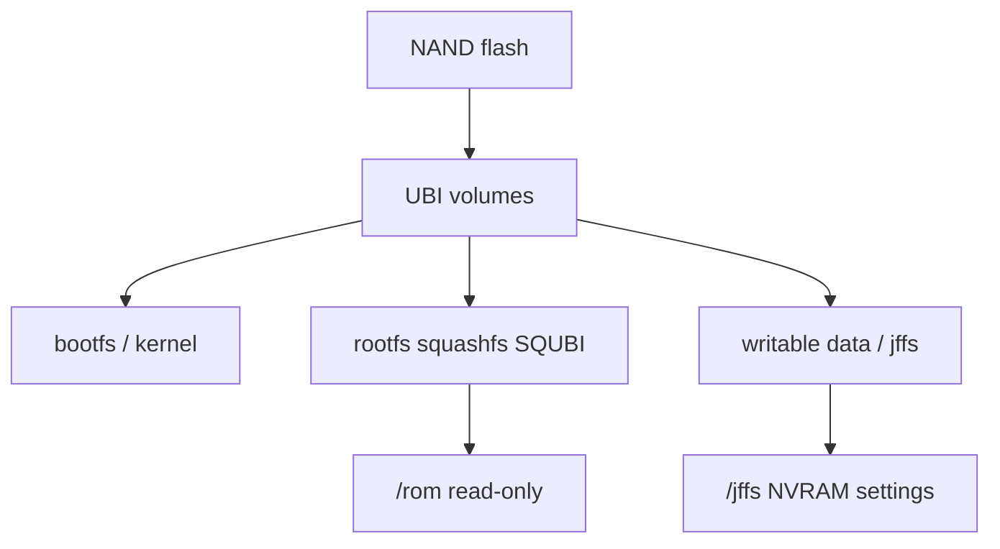

# 03 — Firmware file formats

Artifacts under **`targets/96813GW/`** for the GT-BE98 **NAND + squashfs (SQUBI)** profile. This is **not** a classic Asus **`.trx`** image from legacy MIPS builds.

## Format summary

| File | Format | Role |
|------|--------|------|
| `GT-BE98_*_nand_squashfs.pkgtb` | Broadcom **`.pkgtb`** | Primary firmware update image |
| `GT-BE98_*_nand_squashfs_loader.pkgtb` | `.pkgtb` (larger) | Variant including U-Boot loader payload |
| `bcm96813GW_uboot_linux.itb` | **FIT** (U-Boot `mkimage`) | Factory / bootloader Linux bundle |
| `rootfs.img` | **Squashfs** (`hsqs` magic) | Read-only root filesystem blob |
| `fs.install/` | Directory tree | Pre-image staging (not flashed directly) |

Profile flags (from `targets/96813GW/fs/rom/etc/96813GW`):

- `BRCM_FLASH_BUILD_NAND=y`
- `BRCM_FLASH_NAND_ROOTFS_SQUBI=y` — squashfs inside UBI layout
- `BUILD_SYSV_INIT=y`, `BUILD_UBUS=y`

## `.pkgtb` bundle

Broadcom **package table** image for HND routers. For GT-BE98 the filename encodes:

- Model: **`GT-BE98`**
- Storage: **`nand_squashfs`**
- Embedded metadata strings (verified by `tools/verify-artifact.sh`): `nand_squashfs`, `bootfs`, `rootfs`, `squashfs`

**Content model:**

1. **Boot filesystem** region — kernel, DTB, FIT-related blobs as built by SDK `buildimage`.
2. **Root filesystem** — byte-identical embed of **`rootfs.img`** (squashfs). Verification compares `hsqs` offset in `.pkgtb` to standalone `rootfs.img`.

**Loader vs standard update:**

- **`_nand_squashfs.pkgtb`** — normal field update (larger than raw rootfs only; no full U-Boot reflash in typical use).
- **`_nand_squashfs_loader.pkgtb`** — strictly **larger** than the update `.pkgtb` (includes loader component). Use only when recovery/docs call for it.

Flash safety: see [../flashing.md](../flashing.md). Prefer **`GT-BE98_*`** prefixed images over generic `bcm96813GW_*` variants (other board/storage profiles).

## FIT image (`.itb`)

Source template: `bootloaders/obj/binaries/brcm_full_linux.its`.

Verified components (`verify-artifact.sh` + `mkimage -l`):

| Component | Load address (typical) |
|-----------|-------------------------|
| ATF (ARM Trusted Firmware) | `0x4000` |
| U-Boot | `0x1000000` |
| Linux kernel | `0x200000` |
| Device tree | **`fdt_GT-BE98`** |
| Default config | **`conf_lx_GT-BE98`** |

The ITS also lists related DTBs (`fdt_GT-BE98PRO`, ICP variants, etc.); the GT-BE98 product build selects **`fdt_GT-BE98`**.

## `rootfs.img` (squashfs)

- Built from **`fs.install/`** after **`libcreduction`**.
- Magic **`hsqs`** at offset 0.
- Mounted read-only at runtime under the `/rom` layout; writable config on **UBI / JFFS** (see [05-runtime-os.md](05-runtime-os.md)).

Minimum size check in verify script: **10 MiB** (actual images are much larger).

## Runtime storage layout (conceptual)

Merlin flags: `RTCONFIG_UBI=y`, `RTCONFIG_UBIFS=y`, `RTCONFIG_JFFS_NVRAM=y`.

## Verification (`tools/verify-artifact.sh`)

After `./build.sh`, the script checks:

| Check | Meaning |
|-------|---------|
| `.pkgtb` size ≥ 5 MiB | Bundle exists |
| Loader `.pkgtb` > update `.pkgtb` | Expected layout |
| `rootfs.img` ≥ 10 MiB | Rootfs built |
| `mkimage -l` on `.itb` | ATF + U-Boot + kernel + `fdt_GT-BE98` |
| `grep` tokens in `.pkgtb` | Metadata present |
| Squashfs embed | `pkgtb` contains same squashfs bytes as `rootfs.img` |
| `fs.install` paths | `busybox`, `rc`, `libc`, `nvram`, `dhd`, `wl`, `httpd`, `rtecdc.bin` |

This validates **build completeness**, not hardware flash success.

## What we do not decode here

- Full `.pkgtb` header/table structure (proprietary BCM layout).
- Per-partition NAND map beyond profile Kconfig — refer to SDK `options_6813_nand` and Asus recovery docs.

## References

- [../flashing.md](../flashing.md) — where files land, flash cautions
- [../build-guide.md](../build-guide.md) — rebuild and logs
- [05-runtime-os.md](05-runtime-os.md) — what runs after flash
