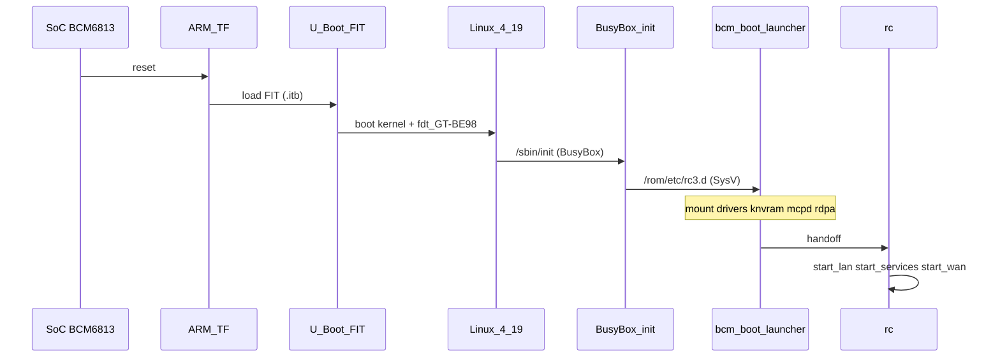

# 05 — Runtime OS architecture

What runs on the GT-BE98 after flash: boot chain, init model, storage, NVRAM, and Asus **`rc`** services.

**Not OpenWrt:** no `procd`, no `ubus` as PID 1. Kconfig has `BUILD_SYSV_INIT=y` and documents SysV + **`bcm_boot_launcher`** (`targets/config.help`).

## Boot sequence



FIT contents and load addresses: [03-firmware-formats.md](03-firmware-formats.md).

## Hardware / DT

`kernel/dts/6813/GT-BE98.dts` (includes `6813.dtsi`):

- **2 GiB DDR4** (`BP_DDR_TOTAL_SIZE_2048MB`)
- **NAND** (`&nand` enabled, write-protect GPIO)
- **PCIe** reorder nodes for WLAN radios (regulators on GPIO 78/75/76/19)

## Storage model

| Mount / area | Typical backing | Writable |
|--------------|-----------------|----------|
| `/rom` | Squashfs root (`rootfs.img`) | No |
| `/jffs` or UBI data | `RTCONFIG_JFFS_NVRAM`, `RTCONFIG_UBI` | Yes — settings, certs |
| USB | `RTCONFIG_USB` | Removable |

Early boot scripts in **`router-sysdep.gt-be98/scripts/std/mount-fs.sh`** install as rc3 entries (**`S25mount-fs`**, **`K95mount-fs`** per `scripts/Makefile`).

## SysV init and `bcm_boot_launcher`

1. **BusyBox** is PID 1.
2. **`bcm_boot_launcher start`** runs scripts in **`/rom/etc/rc3.d`** (symlinks into `/rom/etc/init.d/`).
3. Platform scripts load drivers, NVRAM, MCPD, RDPA, Wi-Fi.
4. **`rc`** (`/sbin/rc`, from Merlin `rc` package) receives control and implements Asus configuration logic.

`release/src/router/rc/init.c`:

```c
system("bcm_boot_launcher start");  /* during bring-up */
/* ... */
system("bcm_boot_launcher stop");    /* on shutdown paths */
```

## rc3.d scripts (GT-BE98 overlay)

Installed from **`router-sysdep.gt-be98`** (exact set depends on driver list):

| Script (typical) | Source | Role |
|------------------|--------|------|
| `S25mount-fs` | `scripts/std/mount-fs.sh` | Mount root/data filesystems |
| `S40hndnvram` | `wlan/scripts/hndnvram.sh` | HND NVRAM / wireless calibration |
| `S45bcm-wlan-drivers` | `wlan/scripts/bcm-wlan-drivers.sh` | Load `wl`/`dhd` if not in base driver list |
| `S26` / wdtd | `wdtctl/scripts/` | Watchdog |
| MCPD / base drivers | `mcpd.sh`, `bcm-base-drivers.sh`, `rdpa_init.sh` | Platform Ethernet/Wi-Fi pipeline |

WLAN Makefile also installs **`wifi.sh`**, **`wluboot2knvram.sh`**, **`mdev_wl.sh`** into init paths.

Broadcom base driver list reference (staged):

```text
targets/96813GW/fs/rom/etc/init.d/bcm-base-drivers.list
```

(if present after build — lists `.ko` modules for `bcm-base-drivers.sh`).

## NVRAM

| Component | Path / binary | Role |
|-----------|---------------|------|
| Merlin `nvram` | `release/src/router/nvram/` | Asus NVRAM key/value API used by `rc` and web UI |
| `bcm_knvram` / kernel | Driver + ioctls | Low-level flash NVRAM |
| `hndnvram.sh` | `router-sysdep.gt-be98/wlan/scripts/` | Early Wi-Fi NVRAM |
| `wluboot2knvram.sh` | same | U-Boot → NVRAM import |
| `init.c` | `release/src/router/rc/init.c` | Applies NVRAM to runtime state |

Persistent user settings land on **JFFS/UBI**, not in the squashfs `/rom` layer.

## `rc` service model

Main logic: **`release/src/router/rc/services.c`**, **`wan.c`**, **`firewall.c`**, triggered from **`init.c`** after platform scripts complete.

Phases (conceptual):

1. **`start_lan`** — bridge/VLAN, LAN ports, wireless LAN interfaces.
2. **`start_services`** — daemons that do not need a WAN IP yet.
3. **`start_wan`** / **`start_wan_if`** — WAN link, DNS, NAT, firewall rules.

GT-BE98-specific `#if defined(GTBE98)` blocks exist throughout `services.c` (LED, port layout, WAN duck, etc.).

### Daemons commonly started by `rc`

| Daemon | Role |
|--------|------|
| `dnsmasq` | LAN DNS/DHCP (`start_dnsmasq`) |
| `httpd` | Web administration |
| `infosvr` | Discovery / info |
| `networkmap` | Client list |
| `wanduck` | WAN link monitoring (signals via `SIGUSR2` on pid files) |
| `watchdog` | Hardware watchdog (`watchdog.c`) |
| `dhd_monitor` | Dongle/firmware health |
| `wbd`, `bsd` | Whole-home Wi-Fi / band steering (when enabled) |
| `miniupnpd`, `ntpd` | UPnP, NTP (when enabled) |
| `openvpn`, `strongswan` | VPN servers/clients (when `RTCONFIG_*`) |
| `firewall` / `iptables` | NAT/filter rules |

Conditional starts follow **`nvram`** keys and **`RTCONFIG_*`** compile-time flags.

## Verified userspace paths (`verify-artifact.sh`)

Minimum set expected under **`targets/96813GW/fs.install/`**:

| Path | Role |
|------|------|
| `bin/busybox` | init applets |
| `sbin/rc` | Asus rc |
| `lib/libc.so.6` + `ld-linux*.so*` | glibc |
| `*/nvram` | NVRAM CLI |
| `usr/sbin/dhd`, `usr/sbin/wl` | Wi-Fi control |
| `usr/sbin/httpd` | Web server |
| `rom/etc/wlan/**/rtecdc.bin` | DHD firmware |

## ubus

`BUILD_UBUS=y` in chip profile — D-Bus-like IPC used by some components; **not** a replacement for SysV init on this product.

## Debugging / factory

- Serial console: BusyBox shell if enabled in NVRAM.
- `router-sysdep.gt-be98/stress/scripts/` — factory stress (not normal boot).
- `bdmf_shell` / `rdpa_init.sh` — Runner dump and RDPA init for platform debug.

## Limits of this document

- Packet path through **RDPA/Runner** is BCM-proprietary; only script/binary **paths** are listed.
- Wi-Fi firmware blobs are documented by location, not reverse-engineered format.
- Runtime order can vary with NVRAM (`rc` branches) — sequence above is the default HND path.

## See also

- [03-firmware-formats.md](03-firmware-formats.md) — what gets flashed
- [04-packages.md](04-packages.md) — what is compiled into the image
- [../flashing.md](../flashing.md) — flash safety
